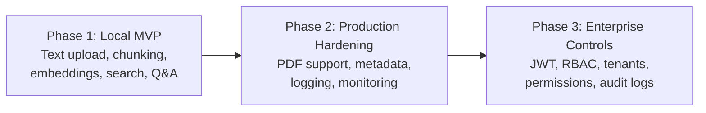

# Enterprise RAG Backend

## RAG Orchestration

The diagram below shows the planned retrieval-augmented generation flow. It separates
document ingestion from question answering while keeping authentication and future
enterprise controls at clear extension points.

```mermaid
flowchart LR
    User["User / Client"]
    Auth["API Key Auth<br/>(MVP)"]

    subgraph Ingestion["Document Ingestion"]
        Upload["Upload Document"]
        Parse["Parse Text"]
        Chunk["Split into Chunks"]
        EmbedDocs["Create Document Embeddings"]
        Store["Store Chunks + Metadata"]
        Upload --> Parse --> Chunk --> EmbedDocs --> Store
    end

    subgraph Retrieval["Question Answering"]
        Ask["Ask Question"]
        EmbedQuery["Create Query Embedding"]
        Search["Similarity Search"]
        Context["Build Grounded Context"]
        Prompt["Construct RAG Prompt"]
        Generate["LLM Generation"]
        Response["Answer + Sources"]
        Ask --> EmbedQuery --> Search --> Context --> Prompt --> Generate --> Response
    end

    VectorDB[("Vector Store")]
    LLM["LLM Provider"]

    User --> Auth
    Auth --> Upload
    Auth --> Ask
    Store --> VectorDB
    VectorDB --> Search
    Generate --> LLM
    LLM --> Response

    Future["Future enterprise layer:<br/>JWT / RBAC / tenants / permissions"]
    Future -.-> Auth
    Future -.-> Search

    classDef boundary fill:#eef2ff,stroke:#4f46e5,stroke-width:1px
    classDef storage fill:#ecfdf5,stroke:#059669,stroke-width:1px
    classDef future fill:#fff7ed,stroke:#ea580c,stroke-width:1px,stroke-dasharray:5 5
    class Ingestion,Retrieval boundary
    class VectorDB storage
    class Future future
```

## Planned Delivery Phases

## Flow Responsibilities

| Area | Responsibility | Initial implementation |
| --- | --- | --- |
| API | Receives uploads and questions | FastAPI |
| Ingestion | Parses and chunks documents | Text files first |
| Embeddings | Converts text into vectors | OpenAI embeddings |
| Retrieval | Finds relevant chunks | ChromaDB similarity search |
| Generation | Produces a grounded answer | OpenAI chat model |
| Security | Protects API endpoints | API key in the MVP |
| Enterprise controls | Restricts data access | Planned for Phase 3 |

## Deliberately Out of Scope for Now

- Application code
- Database setup
- Authentication implementation
- PDF and DOCX parsing
- RBAC and multi-tenant permissions
- Deployment configuration
