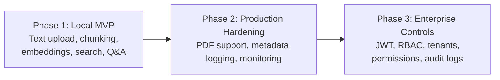

# Enterprise RAG Backend

## RAG Orchestration

The diagram below shows the planned retrieval-augmented generation flow. It separates
document ingestion from question answering while keeping authentication and future
enterprise controls at clear extension points.

```mermaid
flowchart LR
    User["User / Client"]
    Auth["API Key Auth<br/>(MVP)"]

    subgraph Ingestion["Document Ingestion"]
        Upload["Upload Document"]
        Parse["Parse Text"]
        Chunk["Split into Chunks"]
        EmbedDocs["Create Document Embeddings"]
        Store["Store Chunks + Metadata"]
        Upload --> Parse --> Chunk --> EmbedDocs --> Store
    end

    subgraph Retrieval["Question Answering"]
        Ask["Ask Question"]
        EmbedQuery["Create Query Embedding"]
        Search["Similarity Search"]
        Context["Build Grounded Context"]
        Prompt["Construct RAG Prompt"]
        Generate["LLM Generation"]
        Response["Answer + Sources"]
        Ask --> EmbedQuery --> Search --> Context --> Prompt --> Generate --> Response
    end

    VectorDB[("Vector Store")]
    LLM["LLM Provider"]

    User --> Auth
    Auth --> Upload
    Auth --> Ask
    Store --> VectorDB
    VectorDB --> Search
    Generate --> LLM
    LLM --> Response

    Future["Future enterprise layer:<br/>JWT / RBAC / tenants / permissions"]
    Future -.-> Auth
    Future -.-> Search

    classDef boundary fill:#eef2ff,stroke:#4f46e5,stroke-width:1px
    classDef storage fill:#ecfdf5,stroke:#059669,stroke-width:1px
    classDef future fill:#fff7ed,stroke:#ea580c,stroke-width:1px,stroke-dasharray:5 5
    class Ingestion,Retrieval boundary
    class VectorDB storage
    class Future future
```



## Planned Delivery Phases



## Flow Responsibilities

| Area | Responsibility | Initial implementation |
| --- | --- | --- |
| API | Receives uploads and questions | FastAPI |
| Ingestion | Parses and chunks documents | Text files first |
| Embeddings | Converts text into vectors | Gemini embeddings |
| Retrieval | Finds relevant chunks | ChromaDB similarity search |
| Generation | Produces a grounded answer | Gemini chat model |
| Security | Protects API endpoints | API key in the MVP |
| Enterprise controls | Restricts data access | Planned for Phase 3 |

## Phase 1 MVP Status

The initial implementation includes:

- FastAPI application and versioned API routes
- API-key protection through the `X-API-Key` header
- UTF-8 `.txt` and `.md` document uploads
- Configurable fixed-size text chunking
- Gemini embeddings and chat generation
- Persistent ChromaDB storage
- Query responses containing grounded answers and source documents

The following remain intentionally deferred:

- PDF and DOCX parsing
- JWT, RBAC, and multi-tenant permissions
- Background ingestion jobs
- Production deployment and observability

## Local Environment Setup

1. Copy `.env.example` to `.env`.
2. Replace `API_KEY` and `GEMINI_API_KEY` with secret values.
3. Keep `.env` local; it is excluded by `.gitignore`.
4. Start the API with:

   ```powershell
   uvicorn app.main:app --reload
   ```

5. Open `http://127.0.0.1:8000/` in a browser, upload a `.txt` or `.md`
   document, and ask a question about it.

The dashboard uses server-side proxy routes, so it does not ask for or expose
the local `API_KEY` or the Gemini provider key. Direct API clients must still
send `X-API-Key` to the `/api/v1/` routes.
