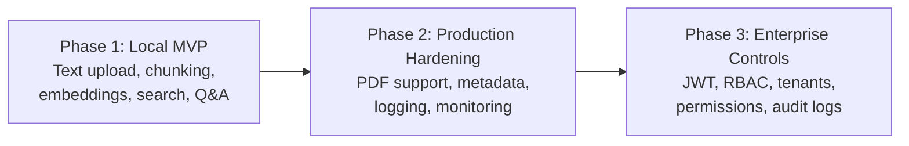

# Enterprise RAG Backend

## RAG Orchestration

The diagram below shows the planned retrieval-augmented generation flow. It separates
document ingestion from question answering while keeping authentication and future
enterprise controls at clear extension points.

```mermaid
flowchart LR
    User["User / Client"]
    Auth["API Key Auth<br/>(MVP)"]

    subgraph Ingestion["Document Ingestion"]
        Upload["Upload Document"]
        Parse["Parse Text"]
        Chunk["Split into Chunks"]
        EmbedDocs["Create Document Embeddings"]
        Store["Store Chunks + Metadata"]
        Upload --> Parse --> Chunk --> EmbedDocs --> Store
    end

    subgraph Retrieval["Question Answering"]
        Ask["Ask Question"]
        EmbedQuery["Create Query Embedding"]
        Search["Similarity Search"]
        Context["Build Grounded Context"]
        Prompt["Construct RAG Prompt"]
        Generate["LLM Generation"]
        Response["Answer + Sources"]
        Ask --> EmbedQuery --> Search --> Context --> Prompt --> Generate --> Response
    end

    VectorDB[("Vector Store")]
    LLM["LLM Provider"]

    User --> Auth
    Auth --> Upload
    Auth --> Ask
    Store --> VectorDB
    VectorDB --> Search
    Generate --> LLM
    LLM --> Response

    Future["Future enterprise layer:<br/>JWT / RBAC / tenants / permissions"]
    Future -.-> Auth
    Future -.-> Search

    classDef boundary fill:#eef2ff,stroke:#4f46e5,stroke-width:1px
    classDef storage fill:#ecfdf5,stroke:#059669,stroke-width:1px
    classDef future fill:#fff7ed,stroke:#ea580c,stroke-width:1px,stroke-dasharray:5 5
    class Ingestion,Retrieval boundary
    class VectorDB storage
    class Future future
```



## Planned Delivery Phases



## Flow Responsibilities

| Area | Responsibility | Initial implementation |
| --- | --- | --- |
| API | Receives uploads and questions | FastAPI |
| Ingestion | Parses and chunks documents | TXT, Markdown, PDF, and Excel |
| Embeddings | Converts text into vectors | Gemini embeddings |
| Retrieval | Finds relevant chunks | ChromaDB similarity search |
| Generation | Produces a grounded answer | Gemini chat model |
| Security | Protects API endpoints | API key in the MVP |
| Enterprise controls | Restricts data access | Planned for Phase 3 |

## Phase 2 Document Ingestion

The initial implementation includes:

- FastAPI application and versioned API routes
- API-key protection through the `X-API-Key` header
- UTF-8 `.txt` and `.md` document uploads
- Text-based `.pdf` document uploads
- `.xlsx`, `.xlsm`, and legacy `.xls` spreadsheet uploads
- Configurable fixed-size text chunking
- Gemini embeddings and chat generation
- Persistent ChromaDB storage
- Query responses containing grounded answers and source documents
- Upload size validation with a configurable 25 MB default

PDF pages are converted to text with `pypdf`. Spreadsheet rows are converted
to labeled text sections containing their sheet names and cell values. Scanned
PDFs with no text layer require OCR and are rejected with a clear message.

The following remain intentionally deferred:

- OCR for scanned PDFs
- JWT, RBAC, and multi-tenant permissions
- Background ingestion jobs
- Production deployment and observability

## Local Environment Setup

1. Copy `.env.example` to `.env`.
2. Replace `API_KEY` and `GEMINI_API_KEY` with secret values.
3. Keep `.env` local; it is excluded by `.gitignore`.
4. Start the API with:

   ```powershell
   uvicorn app.main:app --reload
   ```

5. Open `http://127.0.0.1:8000/` in a browser, upload a `.txt`, `.md`, `.pdf`,
   `.xlsx`, `.xlsm`, or `.xls` document, and ask a question about it.

The dashboard uses server-side proxy routes, so it does not ask for or expose
the local `API_KEY` or the Gemini provider key. Direct API clients must still
send `X-API-Key` to the `/api/v1/` routes.

## Internal Docker Deployment

Docker Compose packages the API and its Python dependencies consistently for
another internal machine. The deployment machine needs Docker Desktop or Docker
Engine and a local `.env` file; do not commit that file.

1. Clone the repository on the deployment machine.
2. Create `.env` from `.env.example` and set `API_KEY` and `GEMINI_API_KEY`.
3. Build and start the service:

   ```powershell
   docker compose up --build -d
   ```

4. Check the service health:

   ```powershell
   docker compose ps
   Invoke-WebRequest http://127.0.0.1:8000/health
   ```

5. Open `http://127.0.0.1:8000/` locally, or replace `127.0.0.1` with the
   deployment machine's private IP for another machine on the same network.

ChromaDB is stored in the named `chroma_data` volume and survives container
restarts. Use `docker compose logs -f` to inspect service logs and
`docker compose down` to stop the service. Do not use `docker compose down -v`
unless you intentionally want to delete the indexed vector data.

This deployment is intended for a trusted internal network. The dashboard
proxy deliberately hides the API key from the browser, but it currently does
not provide per-user login. Before public exposure, add dashboard
authentication, HTTPS, rate limiting, and an enterprise secret manager.
